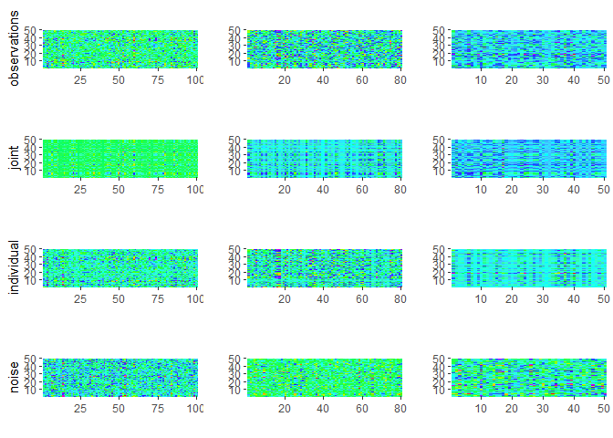

<!-- README.md is generated from README.Rmd. Please edit that file -->

# RaJIVE

<!-- badges: start -->

<!-- badges: end -->

RaJIVE (Robust Angle based Joint and Individual Variation Explained) is
a robust alternative to the aJIVE method for the estimation of joint and
individual components in the presence of outliers in multi-source data.
It decomposes the multi-source data into joint, individual and residual
(noise) contributions. The decomposition is robust to outliers and noise
in the data.

## Installation

You can install the released version of RaJIVE from
[CRAN](https://CRAN.R-project.org) with:

``` r
install.packages("RaJIVE")
```

And the development version from [GitHub](https://github.com/) with:

``` r
# install.packages("devtools")
devtools::install_github("ericaponzi/RaJIVE")
```

## Example

This is a basic example which shows how to use RaJIVE on simple
simulated data:

``` r
library(RaJIVE)
## basic example code
n <- 50
pks <- c(100, 80, 50)
Y <- jive.data.sim(K =3, rankJ = 3, rankA = c(7, 6, 4), n = n,
                   pks = pks, dist.type = 1)

initial_signal_ranks <-  c(7, 6, 4)
data.ajive <- list((Y$sim_data[[1]]), (Y$sim_data[[2]]), (Y$sim_data[[3]]))
ajive.results.robust <- Rajive(data.ajive, initial_signal_ranks)
```

Some instructions on how to visualize results: - Joint rank:

``` r

get_joint_rank(ajive.results.robust)
#> [1] 2
```

  - Individual ranks:

<!-- end list -->

``` r
get_individual_rank(ajive.results.robust, 1)
#> [1] 6
get_individual_rank(ajive.results.robust, 2)
#> [1] 4
get_individual_rank(ajive.results.robust, 3)
#> [1] 2
```

  - Heatmap decomposition:



  - Proportion of variance explained:

<!-- end list -->

``` r
showVarExplained_robust(ajive.results.robust, data.ajive)
#> $Joint
#> [1] 0.2304304 0.2416727 0.3086197
#> 
#> $Indiv
#> [1] 0.6290337 0.5282924 0.3920659
#> 
#> $Resid
#> [1] 0.1405358 0.2300348 0.2993144
```
